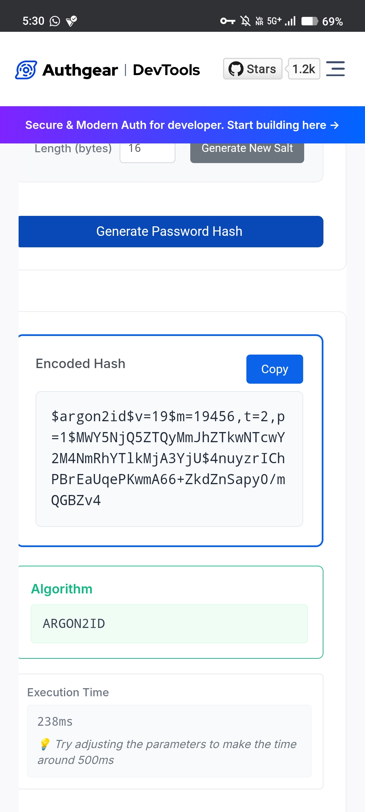
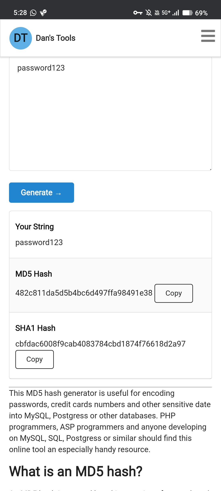
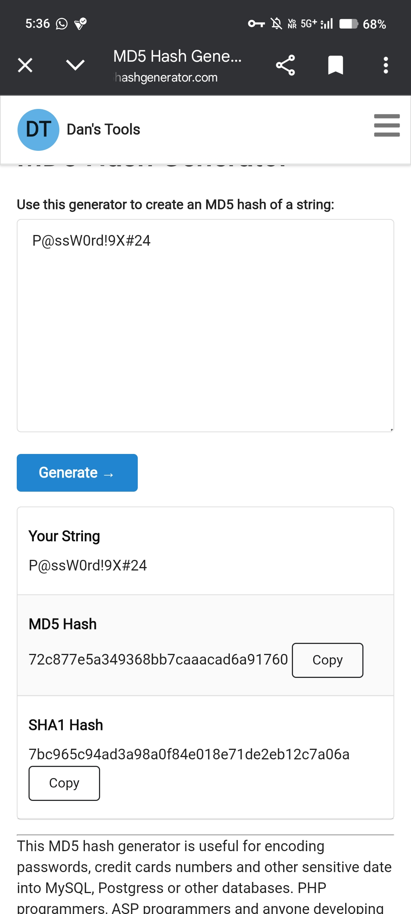
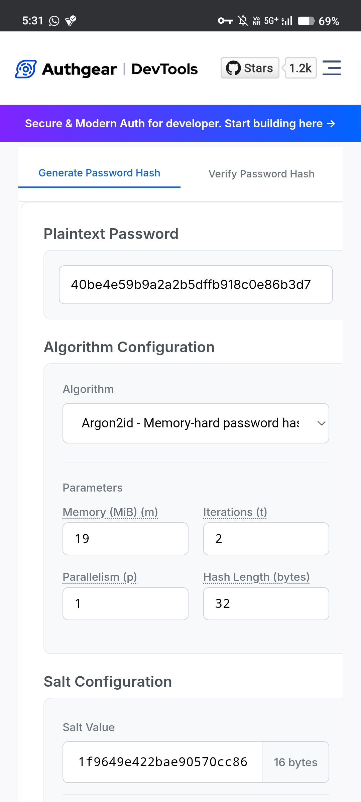

Screenshots folder for Task 4

## Screenshots

### Figure 1: Hash Generation
This screenshot shows the process of generating MD5 and SHA-1 hashes for a given password using an online hash generator.

---

### Figure 2: Weak Password Analysis
This screenshot demonstrates a weak password (`123456`) and its generated hash, highlighting how common passwords are easily processed and vulnerable to attacks.

---

### Figure 3: Strong Password Analysis
This screenshot shows a strong password (`P@ssW0rd!9X#24`) and its generated hash, demonstrating improved security through complexity and length.

---

### Figure 4: Hash Identification
This screenshot illustrates the identification of the hash type using an online hash identifier tool.

